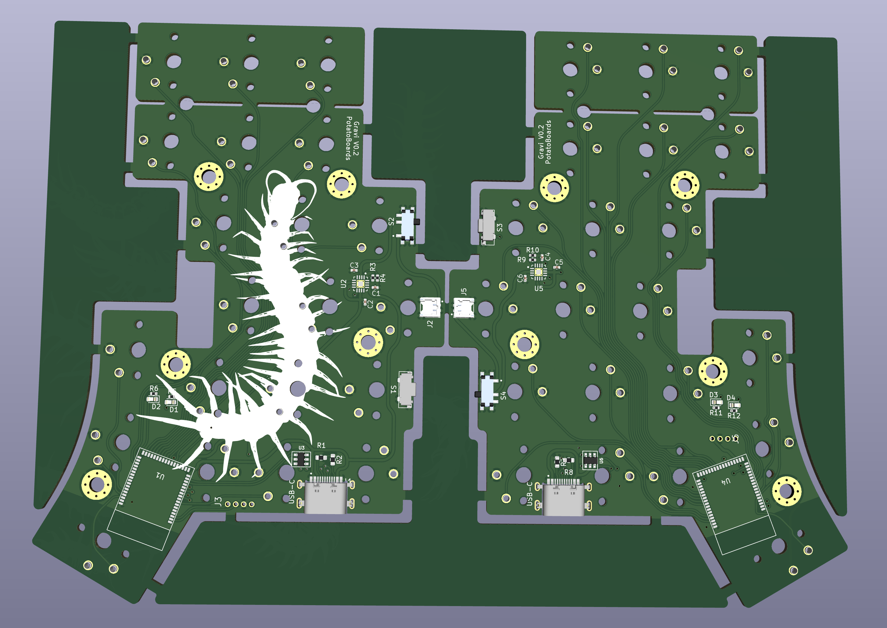
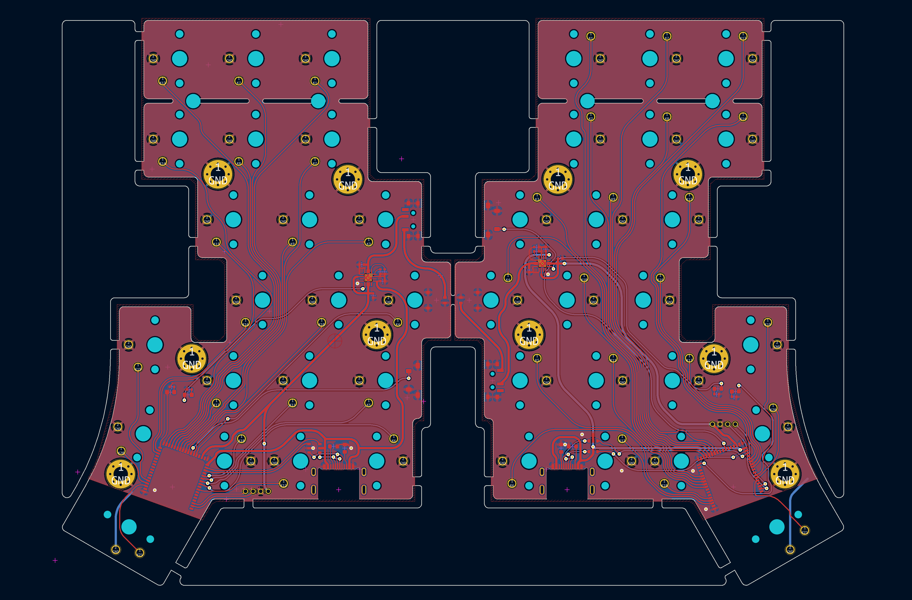
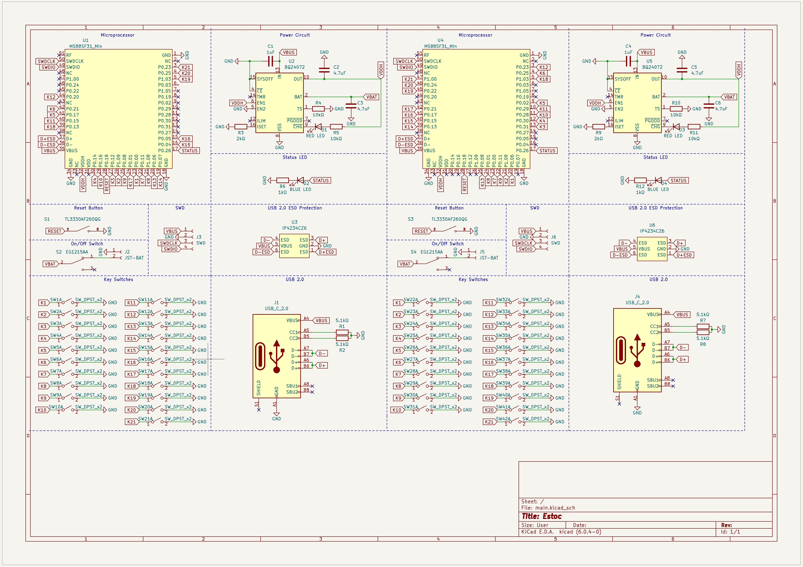
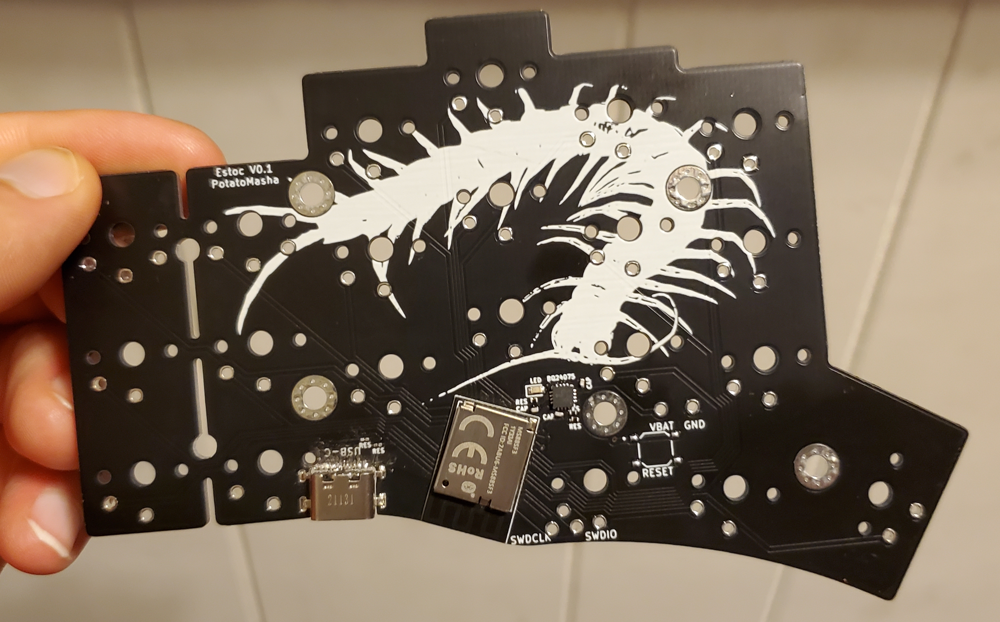
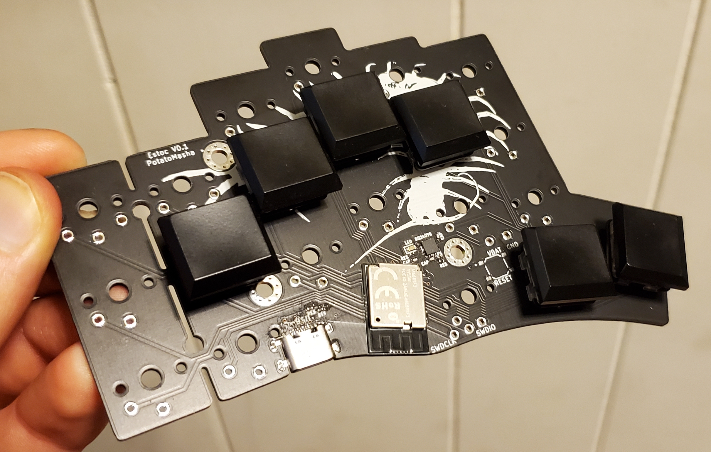
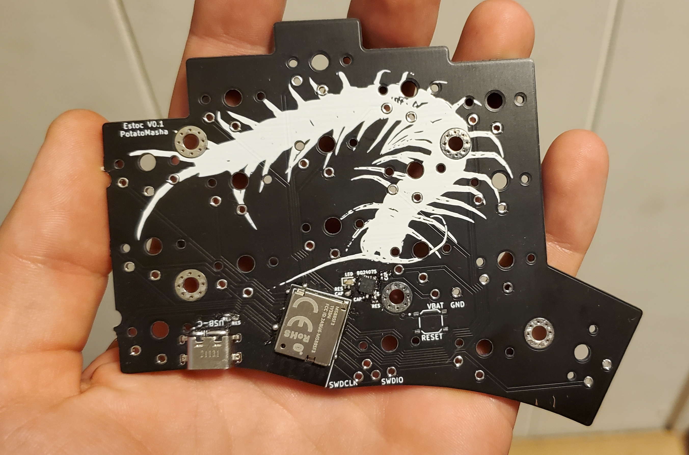

# Estoc

This is a 42 or 36 key, bluetooth keyboard with at least 100mAh battery life per side

Idk exactly what to call this keyboard. The main focus of it is to eliminate the extra area where the system on a chip (SoC) is commonly located. However I've gotten carried away and removed much more. 

A minimal amount of tenting will be required to hold the battery underneath.

Names:
- Estoc
- Crawlerboard
- Gravby
- Mash
- Grash

Specification:
- Split in 2 halves
- Bluetooth low energy
- nRF52 family
- On board SMD components
- No center microcontroller area
- Minimal visible space without keys
- Battery underneath tenting towards usb-c edge
- Milmax sockets

I'm still planning how this will work.
There will be a few keyboard variations made:
- Cherry MX / Kailh
- Kailh choc
- Kailh choc mini ?
- Scissor switch ???

The main focus is the Kailh choc board.

Rohs and FCC compliance will be a hurdle.
Funding may be necessary.
A case will need to be built, by this time aesthetics will be more of a concern.

# V1 Prototypes

