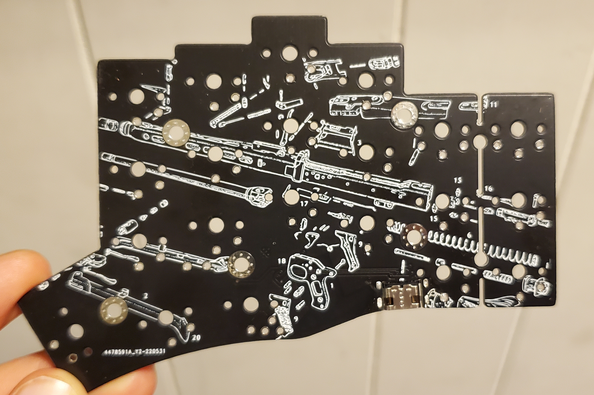

# Gravi

This is a 42 or 36 key, bluetooth keyboard with at least 100mAh battery life per side

Idk exactly what to call this keyboard. The main focus of it is to eliminate the extra area where the system on a chip (SoC) is commonly located. However I've gotten carried away and removed much more. 

A minimal amount of tenting will be required to hold the battery underneath.

## Names:
- Estoc
- Crawlerboard
- Gravby
- Gravbi
- Gravi
- Gravi
- Mash
- Contour Split
- Ergo Berry
- Skeleberry
- DexBerry

## Features:
- Split in 2 halves
- Bluetooth low energy
- nRF52 family
- On-board SMD components
- No center microcontroller area
- Minimal visible space without keys
- Battery underneath tenting towards usb-c edge
- Milmax sockets

There may be 2 sizes for standard and low profile switch types
- Cherry MX / Kailh
- Kailh choc

The main focus is the Kailh choc board (low profile).

Rohs and FCC compliance will be a hurdle.
A case will need to be built, by this time aesthetics will be more of a concern.

# Schematic

# Prototypes

# Revision 4
(Looks the same as rev 3)

# Revision 3

# Revision 2
(Looks the same as rev 3)

# Revision 1

